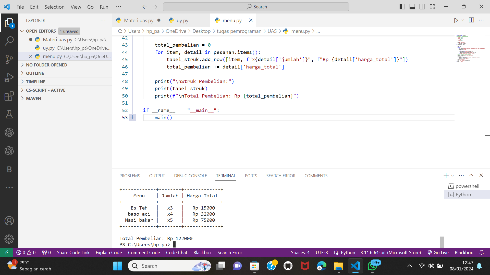

Program ini menjelaskan program sederhana untuk memesan makanan atau minuman, menghitung total pembelian, dan menampilkan struk pembelian menggunakan library PrettyTable. Berikut adalah penjelasan rinci dari setiap bagian program:

1. **Import Library:**
   ```python
   from prettytable import PrettyTable
   ```
   - Program menggunakan library PrettyTable untuk membuat tabel dengan tampilan yang bagus.

2. **Menu dan Harga:**
   ```python
   menu = {
       'Nasi bakar': 15000,
       'Mie rebus telor': 12000,
       'Ayam bakar': 18000,
       'baso aci' : 8000,
       'Es Teh': 5000,
       'Es Jeruk': 6000,
       'Air Mineral': 3000
   }
   ```
   - Dictionary `menu` berisi opsi makanan dan harga masing-masing.

3. **Fungsi `tampilkan_menu`:**
   ```python
   def tampilkan_menu():
       print("Menu Makanan/Minuman:")
       for item, harga in menu.items():
           print(f"{item}: Rp {harga}")
   ```
   - Fungsi ini menampilkan menu makanan/minuman beserta harganya.

4. **Fungsi `hitung_total`:**
   ```python
   def hitung_total(harga, jumlah):
       return harga * jumlah
   ```
   - Fungsi ini menghitung total harga berdasarkan harga satuan dan jumlah yang dipesan.

5. **Fungsi `main`:**
   ```python
   def main():
       pesanan = {}

       while True:
           tampilkan_menu()
           pilihan = input("Masukkan nama makanan/minuman yang ingin dipesan (ketik 'sudah' untuk menampilkan struk): ")

           if pilihan.lower() == 'sudah':
               break

           if pilihan in menu:
               jumlah = int(input(f"Masukkan jumlah {pilihan}: "))
               harga_total = hitung_total(menu[pilihan], jumlah)
               pesanan[pilihan] = {'jumlah': jumlah, 'harga_total': harga_total}
           else:
               print("Menu tidak ada. Silakan pilih menu yang tersedia.")

       # Tampilkan struk pembelian menggunakan PrettyTable
       tabel_struk = PrettyTable()
       tabel_struk.field_names = ["Menu", "Jumlah", "Harga Total"]

       total_pembelian = 0
       for item, detail in pesanan.items():
           tabel_struk.add_row([item, f"x{detail['jumlah']}", f"Rp {detail['harga_total']}"])
           total_pembelian += detail['harga_total']

       print("\nStruk Pembelian:")
       print(tabel_struk)
       print(f"\nTotal Pembelian: Rp {total_pembelian}")

   if __name__ == "__main__":
       main()
   ```
   - Fungsi `main` merupakan inti dari program.
   - Selama pengguna belum memilih 'sudah', program akan menampilkan menu dan meminta pengguna untuk memasukkan pesanan.
   - Jika pesanan valid, program akan menyimpan pesanan beserta jumlah dan total harga dalam dictionary `pesanan`.
   - Setelah pengguna selesai memesan, program akan menampilkan struk pembelian menggunakan PrettyTable, mencetak menu, jumlah, dan harga total setiap pesanan, serta total pembelian keseluruhan.

6. **Eksekusi Program:**
   ```python
   if __name__ == "__main__":
       main()
   ```
   
   - Ini adalah blok yang akan dijalankan jika skrip dijalankan langsung (bukan diimpor sebagai modul).
   - Memanggil fungsi `main` untuk memulai eksekusi program.
